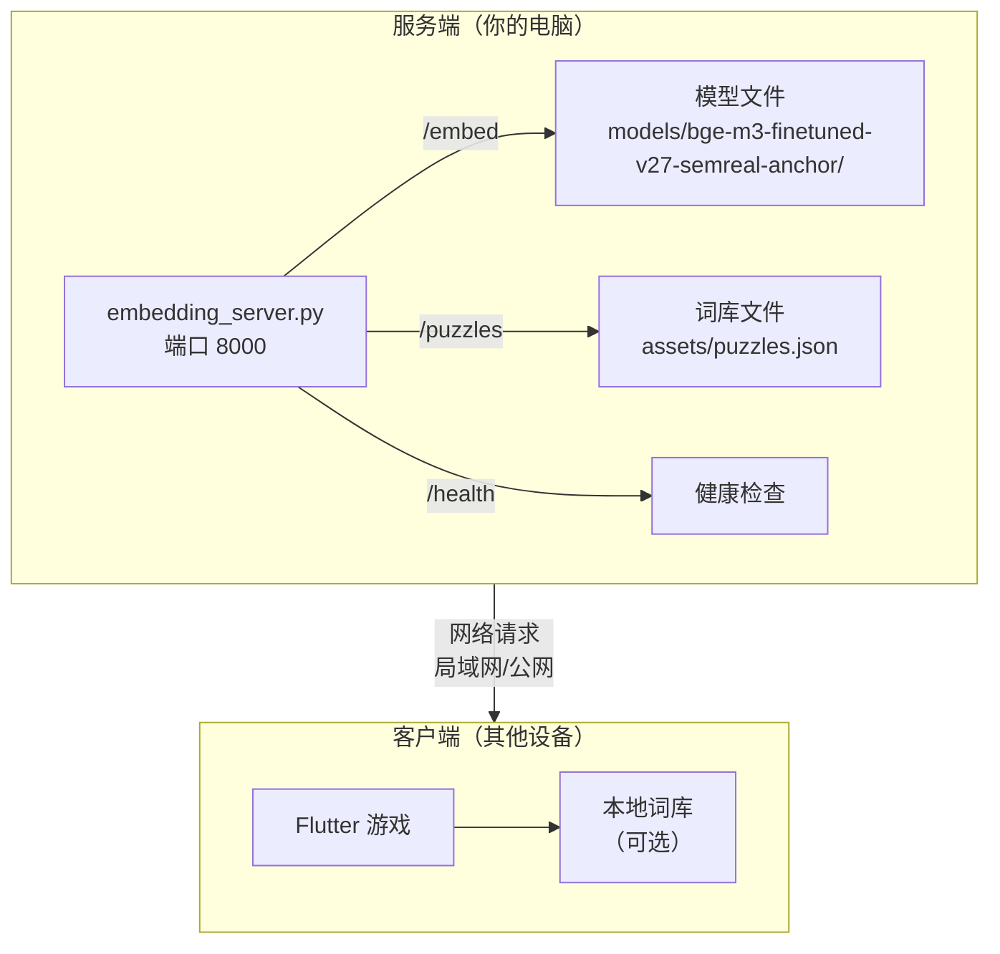
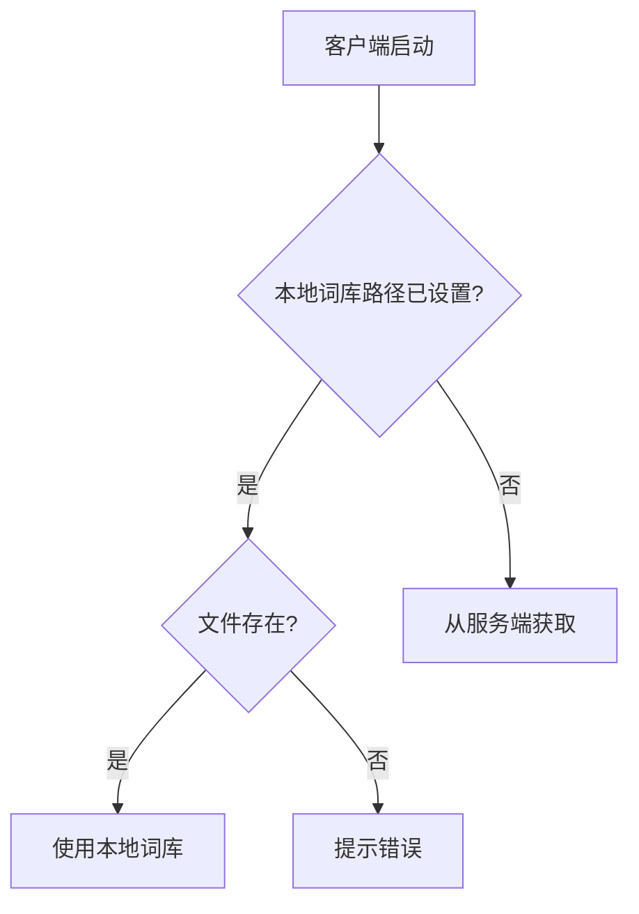

# 词语猜谜（Flutter）

中文猜词小游戏，支持 2-5 个中文字的有效词语输入。

## 快速导航

| 目标 | 章节 | 预估时间 |
|:-----|:-----|:---------|
| 了解规则 | [规则](#规则) | 1 min |
| 快速启动 | [运行](#运行) | 2 min |
| 发布版本 | [多平台发布](#多平台发布) | 5 min |
| 配置服务 | [网络服务配置](#网络服务配置) | 5 min |
| 离线部署 | [离线环境](#离线代理环境) | 10 min |
| 模型训练 | [语义模型迭代](#语义模型离线迭代) | 20 min |

---

## 规则

| 要素 | 说明 |
|:-----|:-----|
| 答案长度 | 2-5 个中文字 |
| 猜测机会 | 共 6 次 |
| 初始提示 | 2 条（符合度 30%、40%） |
| 新增提示 | 每次猜错 +1 条，符合度 +10%，最高 90% |
| 反馈 | 每次猜测显示"符合度百分比" |
| 结局 | 猜对 → 恭喜界面；6 次全错 → 爆炸效果 |

---

## 运行

```bash  # 基础启动
flutter run
```

可在支持的任意平台（移动、Web、桌面）直接运行。若需重新开局，在游戏界面点击"再来一局"或"再试一次"。

---

## 多平台发布

一键构建 Android、Windows、macOS 发布包并上传到 GitHub Release。

### 前置条件

| 依赖 | 安装方式 | 用途 |
|:-----|:---------|:-----|
| Flutter SDK | [官网](https://flutter.dev) | 构建应用 |
| GitHub CLI | macOS: `brew install gh`<br/>Windows: `winget install GitHub.cli` | 创建 Release |
| gh 登录 | `gh auth login` | 访问 GitHub |

### 执行发布

**macOS / Linux / Git Bash**：

```bash
# 正常发布（创建新 Release）
bash scripts/release_build.sh

# 补齐模式（上传到已有 Release，比如在 Windows 上补充 Windows 包）
bash scripts/release_build.sh --supplement
```

**Windows PowerShell**：

```powershell
# 正常发布（创建新 Release）
.\scripts\release_build.ps1

# 补齐模式（上传到已有 Release）
.\scripts\release_build.ps1 -Supplement
```

脚本自动执行以下步骤：

| 模式 | 步骤 |
|:-----|:-----|
| 正常发布 | 检查依赖 → 质量检查 → 构建 → 创建 Release → 清理 |
| 补齐模式 | 检查依赖 → 构建 → 上传到已有 Release → 清理 |

**补齐模式使用场景**：
- macOS 上发布了 Android + macOS，Windows 上补充 Windows 包
- 某个平台构建失败后重新补上

### 输出产物

| 平台 | 文件名 | 安装方式 |
|:-----|:-------|:---------|
| Android | `guess-{version}-android.apk` | 直接安装 |
| Windows | `guess-{version}-windows.zip` | 解压运行 `guess.exe` |
| macOS | `guess-{version}-macos.zip` | 解压打开 `guess.app` |

### 构建说明

| 执行平台 | 构建产物 | 跳过说明 |
|:---------|:---------|:---------|
| macOS | Android + macOS | Windows 显示提示并跳过 |
| Windows | Windows | Android/macOS 显示提示并跳过 |
| Linux | Android（需 Java） | Windows/macOS 显示提示并跳过 |

> 单个平台构建失败不会中断流程，只有全部失败才会终止。

### 系统要求

| 平台 | 最低版本 |
|:-----|:---------|
| Android | Android 5.0 (API 21) |
| Windows | Windows 10 |
| macOS | macOS 10.14 |

### 注意事项

- macOS 首次运行需在「系统偏好设置 → 安全性与隐私」中允许
- 游戏需运行 embedding server 才能正常游玩
- iOS 发布需要 Apple 开发者证书，暂未支持

### 资源包要求

首次拉代码必看：

| 文件 | 路径 | 说明 |
|:-----|:-----|:-----|
| 成功动图 | `assets/images/feedback/success.gif` | 猜中答案时显示 |
| 失败动图 | `assets/images/feedback/fail.gif` | 本轮失败时显示 |

> 若缺失，程序自动回退到内置向量动画（可运行，但视觉效果降级）。详见 `assets/images/feedback/README.md`。

---

## 网络服务配置

本游戏采用**客户端-服务器架构**：

| 角色 | 职责 | 运行内容 |
|:-----|:-----|:---------|
| 服务端 | 提供模型和词库 | `embedding_server.py` (端口 8000) |
| 客户端 | 游戏界面 | Flutter 应用 |

### 架构图



### 服务地址配置

**服务端地址已内置**，客户端无需手动配置：

| 配置项 | 地址 | 优先级 |
|:-------|:-----|:-------|
| 内网模型地址 | `http://192.168.31.224:8000/embed` | 优先使用 |
| 内网词库地址 | `http://192.168.31.224:8000/puzzles` | 优先使用 |
| 公网模型地址 | `https://your-domain.com/embed` | 内网失败时使用 |
| 公网词库地址 | `https://your-domain.com/puzzles` | 内网失败时使用 |

> 修改地址请编辑 `lib/config/server_config.dart`

### 词库优先级



---

### 启动服务端

```bash  # 启动 embedding server（监听 0.0.0.0，允许局域网访问）
python embedding_server.py
```

```bash  # 后台运行（推荐）
nohup python embedding_server.py > /tmp/embedding_server.log 2>&1 &
```

```bash  # 指定模型和词库路径
EMBED_MODEL_DIR=/path/to/model \
PUZZLES_PATH=/path/to/puzzles.json \
python embedding_server.py
```

**验证服务**：

```bash
curl -sS http://192.168.11.29:8000/health
curl -sS http://192.168.11.29:8000/puzzles | head -c 100
```

---

### 词库文件格式

词库为 JSON 数组格式，每个词条包含以下字段：

```json
[
  {
    "answer": "苹果",
    "category": "美食",
    "pos": "名词",
    "hints": [
      "一种常见的水果",
      "红红绿绿的颜色",
      "超市里随处可见",
      "一种常见的水果",
      "常见于超市",
      "一种常见的水果",
      "常见于超市"
    ]
  }
]
```

**字段说明**：

| 字段 | 类型 | 必填 | 说明 |
|:-----|:-----|:-----|:-----|
| `answer` | string | ✅ | 答案，2-5个中文字 |
| `hints` | string[] | ✅ | 提示列表，最多 7 条有效 |
| `category` | string | ❌ | 分类，默认"其他" |
| `pos` | string | ❌ | 词性，默认"名词" |

**提示规则**：
- 每条提示 2-8 个中文字
- 不能与答案相同
- 游戏会自动补充通用提示至 7 条

---

### 环境变量汇总

| 变量 | 默认值 | 说明 |
|:-----|:-------|:-----|
| `EMBED_MODEL_DIR` | `models/bge-m3-finetuned-v27-semreal-anchor` | 本地模型目录 |
| `EMBED_HF_REPO` | `BAAI/bge-m3` | 模型不存在时从 HF 下载 |
| `PUZZLES_PATH` | `./assets/puzzles.json` | 词库文件路径 |
| `EMBED_WARMUP_ON_HEALTH` | `1` | 首次 health 时预热模型 |

```bash  # 完整启动示例
EMBED_MODEL_DIR=/data/models/bge-m3-finetuned-v27 \
PUZZLES_PATH=/data/puzzles.json \
python embedding_server.py
```

---

### 离线 / 代理环境

HuggingFace 下载需要网络访问。受限网络中可手动下载模型：

```
models/
  bge-m3-finetuned-v27-semreal-anchor/
    config.json
    tokenizer_config.json
    tokenizer.json
    model.safetensors     ← 主权重文件（约 2 GB）
```

---

## 环境对齐（一键）

```bash
python3 -m venv .venv
source .venv/bin/activate
pip install -r requirements.txt
```

**快速验证**：

```bash  # 版本检查
python - <<'PY'
import sentence_transformers, transformers, tokenizers
print('sentence-transformers', sentence_transformers.__version__)
print('transformers', transformers.__version__)
print('tokenizers', tokenizers.__version__)
PY
```

```bash  # 回归测试
python scripts/run_regression_pairs_v23.py | tail -n 8
```

---

## 上线前检查清单


**一键执行**：

```bash
bash scripts/preflight_v26.sh
```

**分步执行**：

| 步骤 | 命令 | 预期结果 |
|:-----|:-----|:---------|
| 1. 启动服务 | `python embedding_server.py` | 服务运行在 8000 端口 |
| 2. 健康检查 | `curl -sS http://192.168.11.29:8000/health` | 返回健康状态 |
| 3. 回归测试 | `python scripts/run_regression_pairs_v23.py \| tail -n 8` | 全部通过 |
| 4. 启动 Flutter | `flutter run -d macos` | 应用启动 |

**开启评分追踪**（调试用）：

```bash
flutter run -d macos --dart-define=SCORE_TRACE=true
```

日志输出 `[score_trace]` 开头的 JSON，展示语义/词面/校准/规则命中详情。

---

## 语义模型离线迭代

### 流程概览


### v25 流程（Hint Distill）

```bash
# 1. 构建数据集
python3 scripts/build_v25_hint_distill_dataset.py

# 2. 数据分割
SEM_INPUT_CSV=data/semantic_scoring_v25_hintdistill.csv \
SEM_OUTPUT_DIR=data/splits_v25 \
python3 scripts/split_semantic_dataset.py

# 3. 训练
SEM_TRAIN_CSV=data/splits_v25/semantic_train.csv \
SEM_BASE_MODEL=models/bge-m3-finetuned-v24-patch \
SEM_OUTPUT_MODEL=models/bge-m3-finetuned-v25-hintdistill \
SEM_BATCH_SIZE=8 SEM_EPOCHS=1 SEM_WARMUP_STEPS=80 SEM_LEARNING_RATE=8e-6 \
python3 scripts/finetune_v19_split.py

# 4. 校准
SEM_CALIB_CSV=data/splits_v25/semantic_calib.csv \
SEM_MODEL_PATH=models/bge-m3-finetuned-v25-hintdistill \
SEM_CALIB_OUTPUT_JSON=data/semantic_calibration_v25_hintdistill.json \
python3 scripts/build_v19_calibration_split.py

# 5. 验收
SEM_HOLDOUT_CSV=data/splits_v25/semantic_holdout.csv \
SEM_MODEL_PATH=models/bge-m3-finetuned-v25-hintdistill \
SEM_CALIB_PATH=data/semantic_calibration_v25_hintdistill.json \
python3 scripts/eval_v19_holdout.py
```

**输出文件**：

| 文件 | 说明 |
|:-----|:-----|
| `data/semantic_scoring_v25_hintdistill.csv` | 训练数据 |
| `data/splits_v25/semantic_train.csv` | 训练集 |
| `data/splits_v25/semantic_calib.csv` | 校准集 |
| `data/splits_v25/semantic_holdout.csv` | 验收集 |
| `data/semantic_calibration_v25_hintdistill.json` | 校准曲线 |

---

### v26 流程（金标 + 自监督）

目标：仅保留小批人工金标用于校准与验收；主训练改为无标注自监督。

```bash
# 1. 构建金标 + 自监督数据
python3 scripts/build_v26_gold_and_unsup.py

# 2. 自监督预训练
TOKENIZERS_PARALLELISM=false PYTORCH_MPS_HIGH_WATERMARK_RATIO=0.0 \
SEM_UNSUP_PAIRS_JSONL=data/unsupervised_pairs_v26.jsonl \
SEM_BASE_MODEL=models/bge-m3-finetuned-v25-hintdistill \
SEM_OUTPUT_MODEL=models/bge-m3-finetuned-v26-unsup \
SEM_MAX_PAIRS=5000 SEM_BATCH_SIZE=8 SEM_EPOCHS=1 SEM_WARMUP_STEPS=50 SEM_LEARNING_RATE=6e-6 \
python3 scripts/pretrain_v26_unsupervised.py

# 3. 校准 + 验收
SEM_MODEL_PATH=models/bge-m3-finetuned-v26-unsup \
SEM_CALIB_CSV=data/gold_v26_calib.csv \
SEM_EVAL_CSV=data/gold_v26_eval.csv \
SEM_CALIB_JSON=data/semantic_calibration_v26_gold.json \
python3 scripts/eval_v26_gold.py
```

**输出文件**：

| 文件 | 说明 |
|:-----|:-----|
| `data/gold_v26_pool.csv` | 冻结人工金标池 |
| `data/gold_v26_calib.csv` | 金标校准集 |
| `data/gold_v26_eval.csv` | 金标验收集 |
| `data/unsupervised_pairs_v26.jsonl` | 自监督训练对 |
| `models/bge-m3-finetuned-v26-unsup` | 训练后模型 |
| `data/semantic_calibration_v26_gold.json` | 校准曲线 |

---

## 每晚自动训练（macOS）

### 方案对比

| 方案 | 命令 | 特点 |
|:-----|:-----|:-----|
| Daemon（推荐） | `sudo bash scripts/install_nightly_10pm_daemon.sh` | 不依赖登录会话 |
| LaunchAgent | `bash scripts/install_nightly_10pm_launchd.sh` | 依赖用户会话 |

### Daemon 方式

```bash  # 安装
sudo bash scripts/install_nightly_10pm_daemon.sh
```

```bash  # 查看状态
sudo launchctl print system/com.guess.nightly-train-v26.daemon | egrep 'state =|last exit code =|runs ='
```

```bash  # 卸载
sudo bash scripts/uninstall_nightly_10pm_daemon.sh
```

### LaunchAgent 方式

```bash  # 安装
bash scripts/install_nightly_10pm_launchd.sh
```

```bash  # 查看状态
launchctl list | grep com.guess.nightly-train-v26
```

```bash  # 手动触发
bash scripts/nightly_train_v26.sh
```

```bash  # 演练模式（不真正训练）
NIGHTLY_DRY_RUN=1 bash scripts/nightly_train_v26.sh
```

### 参数配置

| 参数 | 默认值 | 说明 |
|:-----|:-------|:-----|
| `NIGHTLY_AUTO_PROMOTE` | `1` | 达标后自动晋升 |
| `NIGHTLY_DELETE_OLD_ON_PROMOTE` | `1` | 晋升时删除旧模型 |
| `NIGHTLY_DELETE_REJECTED_CANDIDATE` | `1` | 未达标时删除候选 |
| `NIGHTLY_MIN_MAE_IMPROVEMENT` | `0.01` | MAE 最小改善阈值 |
| `NIGHTLY_MIN_ACC_IMPROVEMENT` | `0.3` | 准确率最小改善阈值 |
| `NIGHTLY_TOTAL_RUNS` | `1` | 每晚训练轮数 |
| `NIGHTLY_PROMOTE_WEEKDAYS` | `6,7` | 仅周末晋升（6=周六，7=周日） |

### 日志位置

| 日志 | 路径 |
|:-----|:-----|
| 训练日志 | `.nightly/data/tmp/nightly_train_v26_*.log` |
| 标准输出 | `.nightly/logs/launchd_nightly_v26.out.log` |
| 错误输出 | `.nightly/logs/launchd_nightly_v26.err.log` |
| 轮次汇总 | `.nightly/data/tmp/nightly_round_summary_*.txt` |

### 验收夜训结果

```bash  # 严格要求晋升成功
bash scripts/verify_nightly_outcome_v26.sh
```

```bash  # 允许本轮未晋升
bash scripts/verify_nightly_outcome_v26.sh --allow-reject
```

---

## 生产默认与回滚

| 配置项 | 当前值 |
|:-------|:-------|
| 默认模型 | `models/bge-m3-finetuned-v27-semreal-anchor` |
| 默认校准 | `data/semantic_calibration_v27_semreal_anchor.json` |
| 配置索引 | `config/current_model.json` |
| 人工覆盖 | `data/manual_similarity_overrides.json` |
| 回滚模型 | `models/bge-m3-finetuned-v21-refine` |

### 跨电脑携带

**需要拷贝的文件**：

```
models/bge-m3-finetuned-v27-semreal-anchor/
data/semantic_calibration_v27_semreal_anchor.json
data/manual_similarity_overrides.json
```

**非默认路径启动**：

```bash
EMBED_MODEL_DIR=/你的路径/bge-m3-finetuned-v27-semreal-anchor \
python embedding_server.py
```

**验证**：

```bash
bash scripts/preflight_v26.sh
curl http://192.168.11.29:8000/health
```

---

## 提示自然化收敛（2026-03-02）

| 项目 | 说明 |
|:-----|:-----|
| 数据文件 | 通过词库服务获取 |
| 清洗策略 | `lib/services/puzzle_repository.dart` |
| 对比报告 | `tmp/puzzle_naturalness_diff_report.py` |
| 受影响词条 | 0 |

**复验命令**：

```bash
curl -sS http://192.168.11.29:8000/puzzles | python -c "import sys,json;json.load(sys.stdin);print('puzzles ok')"
python tmp/puzzle_naturalness_diff_report.py
```

**查看报告摘要**：

```bash
python - <<'PY'
from pathlib import Path
print('\n'.join(Path('tmp/puzzle_naturalness_report.md').read_text(encoding='utf-8').splitlines()[:20]))
PY
```
