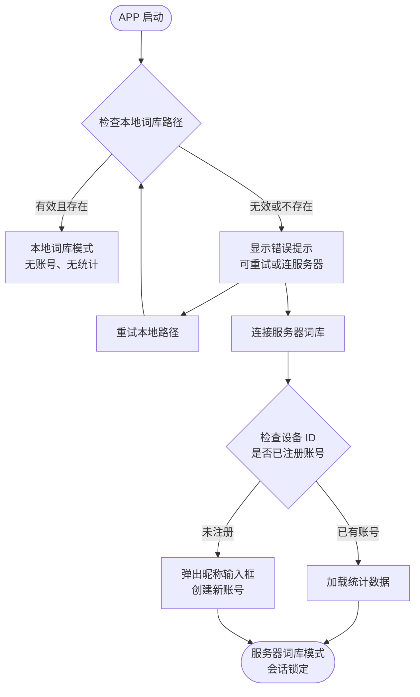
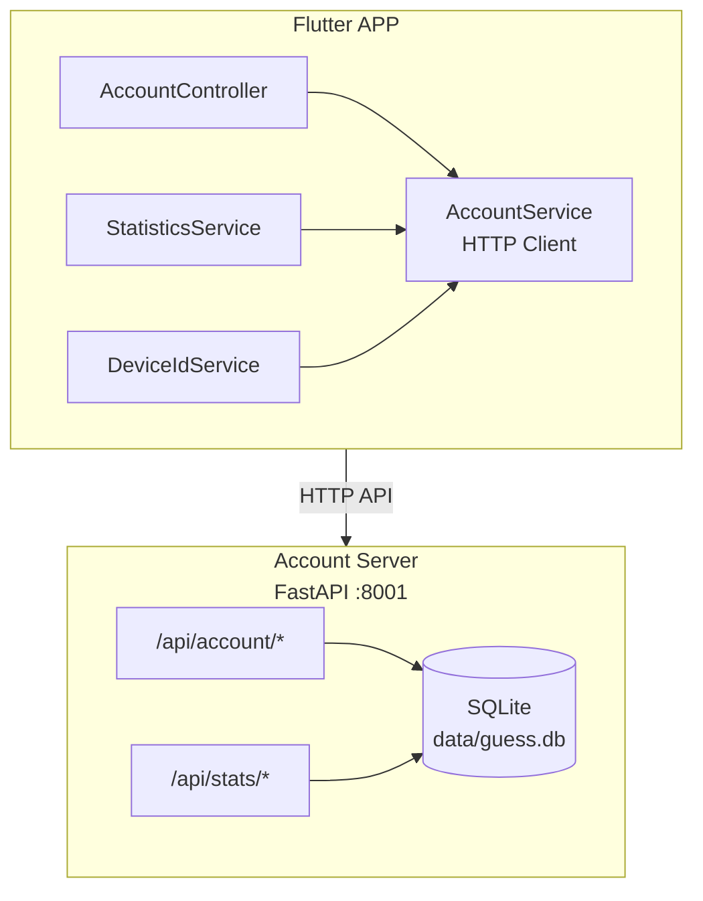
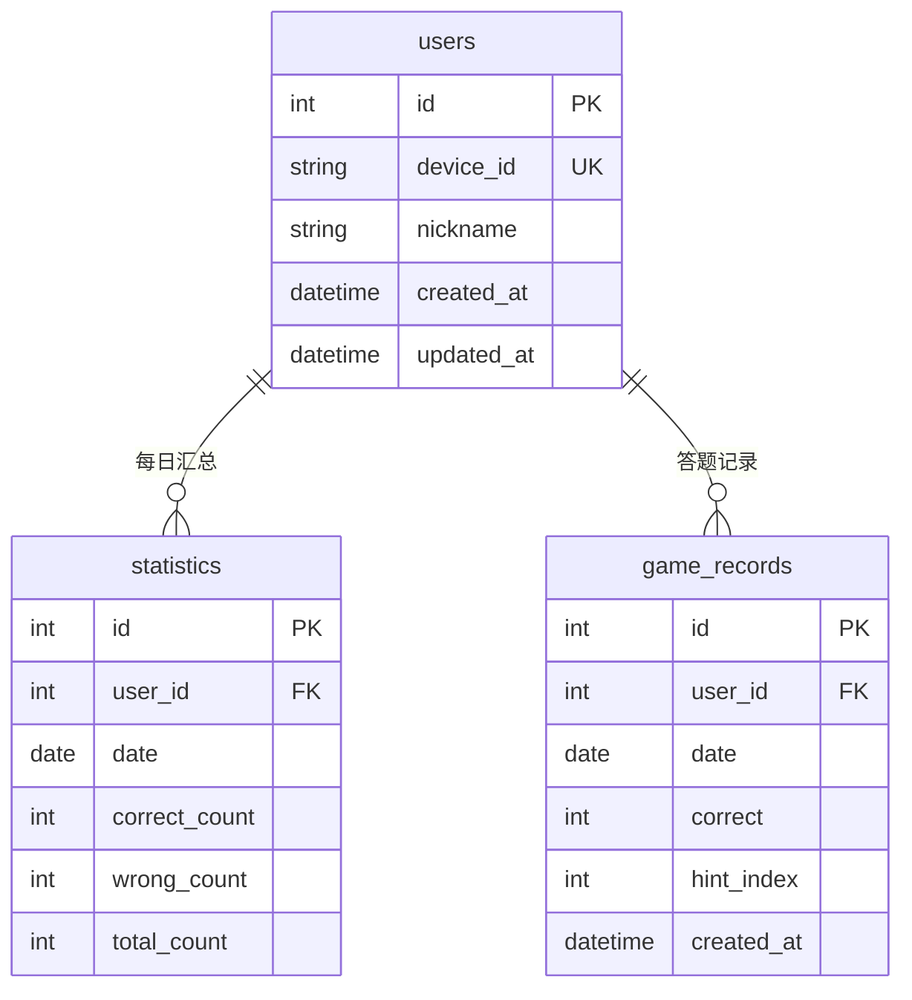

# 词语猜谜 - 用户系统与词库模式设计

## 快速导航

| 目标 | 章节 |
|:-----|:-----|
| 理解核心规则 | [核心规则](#核心规则) |
| 查看架构设计 | [架构设计](#架构设计) |
| 了解 API 接口 | [API 设计](#api-设计) |
| 查看实现步骤 | [实现步骤](#实现步骤) |

---

## 概述

为词语猜谜 Flutter 游戏添加用户系统和双词库模式支持。用户可选择本地词库模式（无账号、无统计）或服务器词库模式（有账号、有统计）。

---

## 核心规则

### 两种词库模式

| 模式 | 账号 | 统计 | 数据库记录 |
|:-----|:----:|:----:|:----------:|
| 本地词库 | 无 | 无 | 无 |
| 服务器词库 | 有 | 有 | 有 |

### 模式切换流程



### 会话锁定规则

| 规则 | 说明 |
|:-----|:-----|
| 锁定触发 | 连接服务器词库成功后 |
| 锁定范围 | 当前 APP 会话 |
| 断网行为 | 不能切换回本地词库模式 |
| 解锁方式 | 重启 APP |

---

## 架构设计

### 整体架构



### 新增文件清单

#### Flutter 端

| 文件路径 | 说明 |
|:---------|:-----|
| `lib/controllers/account_controller.dart` | 账号状态控制器 |
| `lib/services/account_service.dart` | 账号 API 客户端 |
| `lib/services/statistics_service.dart` | 统计 API 客户端 |
| `lib/services/device_id_service.dart` | 设备 ID 生成服务 |
| `lib/widgets/account_creation_dialog.dart` | 昵称输入对话框 |
| `lib/widgets/user_profile_menu.dart` | 用户下拉菜单组件 |

#### 服务器端

| 文件路径 | 说明 |
|:---------|:-----|
| `account_server.py` | FastAPI 用户服务 |
| `scripts/init_account_db.py` | 数据库初始化脚本 |

---

## UI 设计

### AppBar 设计

| 位置 | 本地模式 | 服务器模式 |
|:-----|:---------|:-----------|
| 左侧 | APP 标题 "词语猜谜" | APP 标题 + 绿色状态灯 |
| 右侧 | 设置按钮 (tune) | 用户头像/昵称 + 设置按钮 |

### 用户下拉菜单

```
┌─────────────────────────────────┐
│  [头像] 昵称                     │
│  ─────────────────────────────  │
│  答对：123 次                    │
│  答错：45 次                     │
│  总计：168 次                    │
│  正确率：73.2%                   │
│  ─────────────────────────────  │
│  今日：答对 5 / 总计 8           │
└─────────────────────────────────┘
```

### 设置页面变更

| 操作 | 内容 |
|:-----|:-----|
| **删除** | 本地模型目录输入框、在线模型地址输入框 |
| **新增** | 本地词库路径输入框（文本 + 选择按钮） |
| **提示** | 保存后显示"重启生效" |

### 错误提示设计

```
┌─────────────────────────────────────────┐
│  ⚠️ 词库加载失败                         │
│  本地词库路径不存在或无效                 │
│  请检查设置中的词库路径                   │
│                                         │
│  [重试]        [连接服务器词库]           │
└─────────────────────────────────────────┘
```

### 输入框优化

| 项目 | 原有 | 优化后 |
|:-----|:-----|:-------|
| 输入类型 | 仅中文 | 中文 + 英文 |
| 示例 | "猫咪" | "猫咪"、"apple" |
| 提示文本 | "输入词语" | "输入中文或英文词语" |

---

## 数据库设计

### SQLite Schema

```sql #用户表
CREATE TABLE users (
    id INTEGER PRIMARY KEY AUTOINCREMENT,
    device_id TEXT UNIQUE NOT NULL,
    nickname TEXT NOT NULL,
    created_at DATETIME DEFAULT CURRENT_TIMESTAMP,
    updated_at DATETIME DEFAULT CURRENT_TIMESTAMP
);
```

```sql #统计汇总表
CREATE TABLE statistics (
    id INTEGER PRIMARY KEY AUTOINCREMENT,
    user_id INTEGER NOT NULL,
    date DATE NOT NULL,
    correct_count INTEGER DEFAULT 0,
    wrong_count INTEGER DEFAULT 0,
    total_count INTEGER DEFAULT 0,
    FOREIGN KEY (user_id) REFERENCES users(id),
    UNIQUE(user_id, date)
);
```

```sql #答题详情表
CREATE TABLE game_records (
    id INTEGER PRIMARY KEY AUTOINCREMENT,
    user_id INTEGER NOT NULL,
    date DATE NOT NULL,
    correct INTEGER NOT NULL,           -- 1=答对, 0=答错
    hint_index INTEGER DEFAULT -1,      -- 提示词序号(0-6), 答错为-1
    created_at DATETIME DEFAULT CURRENT_TIMESTAMP,
    FOREIGN KEY (user_id) REFERENCES users(id)
);
```

```sql #索引
CREATE INDEX idx_statistics_user_date ON statistics(user_id, date);
CREATE INDEX idx_game_records_user_date ON game_records(user_id, date);
```

### 表关系



---

## API 设计

### Account Server 端点

| 端点 | 方法 | 说明 |
|:-----|:----:|:-----|
| `/api/account/create` | POST | 创建用户 |
| `/api/account/by_device/{device_id}` | GET | 查询用户 |
| `/api/account/nickname` | PUT | 更新昵称 |
| `/api/stats/summary/{user_id}` | GET | 统计汇总 |
| `/api/stats/today/{user_id}` | GET | 今日统计 |
| `/api/stats/record` | POST | 记录答题 |

### 用户 API

```json #创建用户
POST /api/account/create
请求: { "device_id": "xxx", "nickname": "昵称" }
响应: { "success": true, "user": { "id": 1, "nickname": "昵称" } }
```

```json #查询用户
GET /api/account/by_device/{device_id}
响应: { "success": true, "user": { "id": 1, "nickname": "昵称" } }
失败: { "success": false, "error": "not_found" }
```

```json #更新昵称
PUT /api/account/nickname
请求: { "device_id": "xxx", "nickname": "新昵称" }
响应: { "success": true }
```

### 统计 API

```json #统计汇总
GET /api/stats/summary/{user_id}
响应: {
    "success": true,
    "summary": {
        "correct_count": 123,
        "wrong_count": 45,
        "total_count": 168,
        "accuracy": 73.2
    }
}
```

```json #今日统计
GET /api/stats/today/{user_id}
响应: {
    "success": true,
    "today": {
        "correct_count": 5,
        "wrong_count": 3,
        "total_count": 8
    }
}
```

```json #记录答题
POST /api/stats/record
请求: {
    "user_id": 1,
    "correct": true,
    "date": "2026-06-04",
    "hint_index": 2
}
// hint_index: 第几条提示词答对(0-6), 答错时为-1
响应: { "success": true }
```

---

## 设备 ID 生成方案

### 各平台字段

| 平台 | 字段 | 说明 |
|:-----|:-----|:-----|
| macOS | `systemGUID` | 硬件 UUID |
| iOS | `identifierForVendor` | 供应者标识 |
| Windows | `deviceId` | 设备 ID |
| Linux | `machineId` | 机器 ID |
| Android | `androidId` | 安卓 ID |

### 生成逻辑

```dart #设备ID生成
String deviceId = sha256(deviceInfo + appNameSalt).substring(0, 32);
```

---

## 配置修改

### ServerConfig 更新

```dart #服务配置
class ServerConfig {
  // 现有配置
  static const List<String> lanHosts = ['192.168.11.29'];
  static const String publicHost = 'your-domain.com';
  static const int port = 8000;

  // 新增账号服务端口
  static const int accountPort = 8001;

  // 账号服务端点
  static List<String> get lanAccountEndpoints =>
      lanHosts.map((h) => 'http://$h:$accountPort/api').toList();
  static String get publicAccountEndpoint =>
      'https://$publicHost/api';
}
```

### pubspec.yaml 新增依赖

```yaml #依赖
dependencies:
  device_info_plus: ^10.1.0
  crypto: ^3.0.3
  http: ^1.2.0
```

---

## 状态管理

### AccountController

```dart #账号控制器
class AccountController extends GetxController {
  final Rx<User?> user = Rx(null);
  final RxBool isConnectedToServer = false.obs;
  final Rx<StatisticsSummary?> statistics = Rx(null);

  bool get isLoggedIn => user.value != null;

  Future<void> connectToServerPuzzles() async { ... }
  Future<void> createAccount(String nickname) async { ... }
  Future<void> loadStatistics() async { ... }
  Future<void> recordGameResult(bool correct, int hintIndex) async { ... }
}
```

---

## 实现步骤

### 第一阶段：服务器端

| 步骤 | 内容 |
|:-----|:-----|
| 1 | 创建 `account_server.py` FastAPI 服务 |
| 2 | 创建数据库初始化脚本 |
| 3 | 实现用户和统计 API |

### 第二阶段：Flutter 基础设施

| 步骤 | 内容 |
|:-----|:-----|
| 1 | 添加 `device_info_plus` 依赖 |
| 2 | 创建 `DeviceIdService` |
| 3 | 创建 `AccountService` HTTP 客户端 |
| 4 | 创建 `StatisticsService` |

### 第三阶段：状态管理

| 步骤 | 内容 |
|:-----|:-----|
| 1 | 创建 `AccountController` |
| 2 | 修改 `GuessGameController` 集成账号状态 |

### 第四阶段：UI 实现

| 步骤 | 内容 |
|:-----|:-----|
| 1 | 修改 AppBar 显示逻辑 |
| 2 | 创建用户下拉菜单组件 |
| 3 | 创建昵称输入对话框 |
| 4 | 修改设置页面 |
| 5 | 实现错误提示和重连逻辑 |
| 6 | 优化输入框支持中英文 |

### 第五阶段：集成测试

| 步骤 | 内容 |
|:-----|:-----|
| 1 | 测试本地词库模式 |
| 2 | 测试服务器词库模式 |
| 3 | 测试模式切换逻辑 |
| 4 | 测试统计数据记录 |

---

## 验证方案

### 手动测试

| 场景 | 操作 | 验证点 |
|:-----|:-----|:-------|
| 本地模式正常 | 设置路径 → 重启 | 本地模式工作正常 |
| 本地模式异常 | 设置无效路径 → 重启 | 错误提示显示 |
| 服务器账号创建 | 点击连接服务器 | 昵称对话框弹出 |
| 服务器统计 | 答题 | 统计数据更新 |
| 会话锁定 | 连接后断网 | 不能切换回本地 |

### API 测试命令

```bash #健康检查
curl http://localhost:8001/health
```

```bash #创建用户
curl -X POST http://localhost:8001/api/account/create \
  -H "Content-Type: application/json" \
  -d '{"device_id":"test123","nickname":"测试用户"}'
```

```bash #查询用户
curl http://localhost:8001/api/account/by_device/test123
```

```bash #记录答题
curl -X POST http://localhost:8001/api/stats/record \
  -H "Content-Type: application/json" \
  -d '{"user_id":1,"correct":true,"date":"2026-06-04","hint_index":2}'
```

```bash #查询统计
curl http://localhost:8001/api/stats/summary/1
```